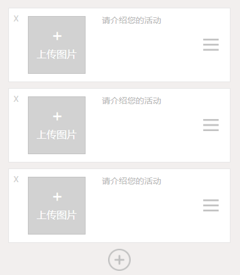
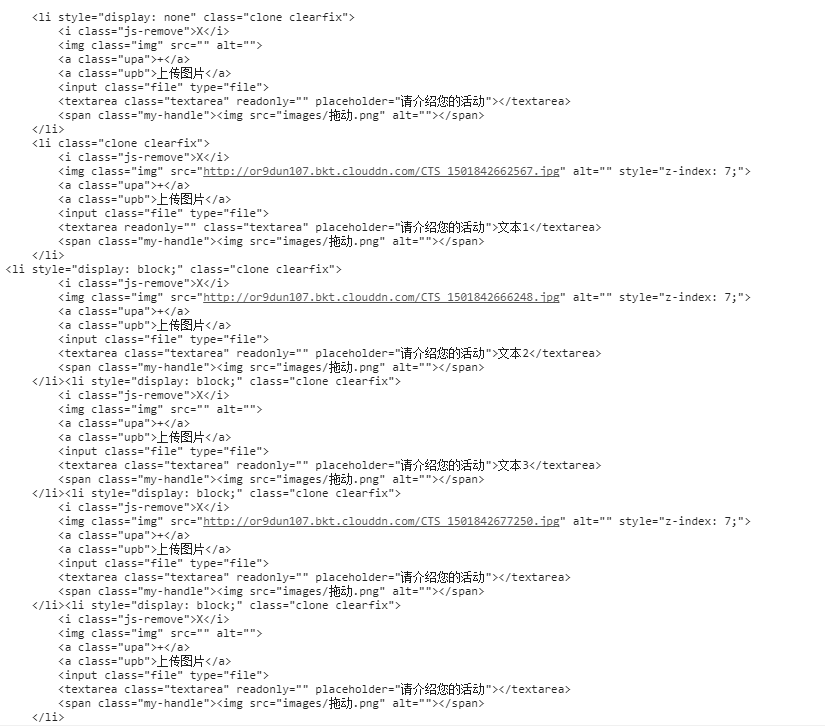
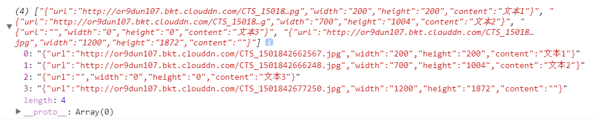

# draggable
### 可拖拽排序、编辑文本、上传图片的多功能编辑器
### 可添加模块，删除模块
### 使用HTML5 FileReader获取图片，实现本地预览，并异步上传到七牛服务器，然后返回当前图片地址，替换本地路径
### 无论上传图片还是编辑文本 核心：记录当前的模块的索引
### 效果图  

### 添加模块时候，不能字符串拼接html结构，否则不能绑定事件，要采用clone(true)深拷贝，clone结构和事件
         //clone;
        $(".add").click(function(){
            $(".clone").first().clone(true).css({"display":"block"}).appendTo($("#editable"))
        })
        
### 设置拖动区域  
#### 点击删除 判断当前模块是否上传了图片或编辑了文字 如果有 则询问是否删除 点击确认才删除 空模块则直接删除
       // 拖动排序 设置拖动区域
        var editableList = Sortable.create(editable, {
            sort:"true",
            animation: 150,
            handle: '.my-handle',  //设置拖动区域 默认是当前列表 但移动端不适合 
            filter: '.js-remove',  //设置删除的按钮  
            onFilter: function (evt) {
                var el = editableList.closest(evt.item); // get dragged item
                //console.log(typeof el);
                //console.log(evt.item);
                //console.log(evt.item.children);
                //console.log(evt.item.children[1]);
                //console.log(evt.item.children[1].currentSrc);
                //console.log(evt.item.children[5].innerHTML);
                if(evt.item.children[1].currentSrc != "" || evt.item.children[5].innerHTML != ""){
                    layer.open({
                        skin:"demo-class",
                        content: '确认删除？',
                        btn: ['确认', '取消'],
                        shadeClose: false,
                        yes: function(){
                            layer.open({content: '确认', time: 1});
                            el && el.parentNode.removeChild(el);
                        }, no: function(){
                            layer.open({content: '您选择了取消', time: 1});
                        }
                    })
                }
                else{
                    el && el.parentNode.removeChild(el);
                }
            },
        });
      
## 数据结构转换成app可用的结构
### 代码已经封装好了 注释也很清楚 详见 create.js
 ### 将如下html结构
               
 ### 转化为app可用的数据结构
    

